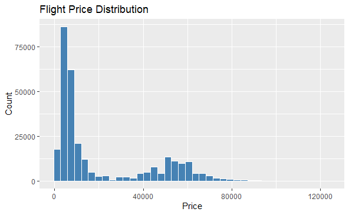
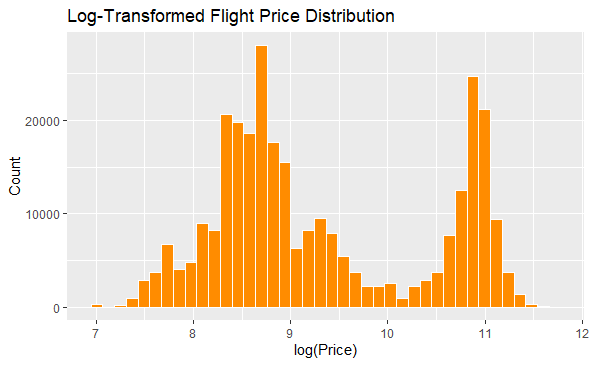
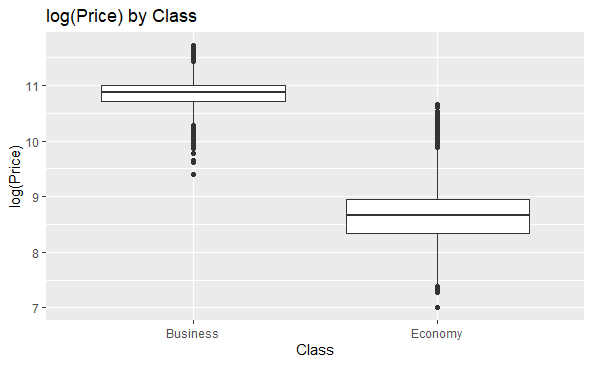
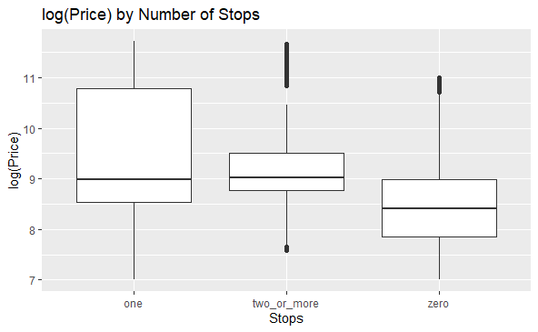

# Predicting Airline Ticket Prices Using Statistical Learning

Built and compared three statistical learning models on **300,153 commercial flight records** to predict ticket prices. The final Random Forest model achieved an **R² of 0.972** with a test-set RMSE of **~₹3,610** — less than half the prediction error of the linear baselines.

## Business Problem

Airline prices fluctuate constantly due to pricing strategies, seasonality, and consumer behavior, making costs hard to anticipate for travelers and hard to model for businesses. This project identifies which flight attributes actually drive ticket prices and builds a predictive framework that estimates fares from commonly available features — the same type of modeling that powers fare-tracking tools and airline revenue analytics.

## Data

- **Source:** [Flight Price Prediction (Kaggle)](https://www.kaggle.com/datasets/shubhambathwal/flight-price-prediction) — domestic Indian flights, 2022
- **Size:** 300,153 observations × 11 variables
- **Features:** airline, travel class, number of stops, departure/arrival time, source/destination city, duration, days left before departure
- **Target:** ticket price (₹)

## Approach

1. **EDA:** Raw prices were heavily right-skewed, so the target was log-transformed to stabilize variance and satisfy modeling assumptions. Boxplots and grouped summaries flagged travel class, airline, and number of stops as the strongest candidate predictors.
2. **Preprocessing:** Categorical features converted to factors with reference levels set to the most frequent category; identical factor levels enforced across the stratified train/test split to prevent leakage and inconsistency.
3. **Modeling:** Three approaches, evaluated on a held-out test set using RMSE (log scale and original ₹ scale) and R²:
   - Multiple Linear Regression (interpretable baseline)
   - Elastic Net via `glmnet` (cross-validated ridge/lasso blend)
   - Random Forest via `ranger` (200 trees, tuned predictors per split)

| Model | RMSE (log) | R² (log) | RMSE (₹) |
|---|---|---|---|
| Baseline MLR | 0.324 | 0.915 | 7,777 |
| Elastic Net (α = 0.5) | 0.324 | 0.915 | 7,703 |
| **Random Forest** | **0.185** | **0.972** | **3,610** |

## Key Findings

- **Travel class dominates pricing.** Business-class fares are consistently higher and more variable than economy — class was the single strongest predictor in variable importance rankings, followed by airline, days left before departure, and duration.
- **Booking timing matters nonlinearly.** Prices spike sharply for last-minute bookings — a pattern the tree-based model captured but linear models could not, explaining much of the 2x accuracy gap.
- **Nonlinear methods earn their complexity here.** MLR and Elastic Net performed nearly identically (regularization stabilized coefficients but didn't add accuracy), indicating the limitation was linearity itself, not overfitting.

**Log transformation reveals the market's two-tier structure** — the bimodal distribution below corresponds to economy vs. business class:

**Class and stops both separate prices clearly on the log scale:**

## Tools

**R** — tidyverse (ggplot2, dplyr), caret, glmnet, ranger, forcats, readxl

## Repository Contents

- [`flight_price_project_script.Rmd`](flight_price_project_script.Rmd) — full analysis code (EDA → modeling → evaluation)
- [`flight_price_characteristics_dataset.csv`](flight_price_characteristics_dataset.csv) — dataset
- [`flight_price_project_final_report.pdf`](flight_price_project_final_report.pdf) — complete written report
- [`images/`](images/) — figures referenced above

## Future Work

Gradient boosting (XGBoost/LightGBM), external features such as holidays and fuel prices, and interaction terms to improve the interpretable linear models.

---

*Jack Griffin · B.S.B.A. Economics, Statistics Minor · University of Central Florida*
